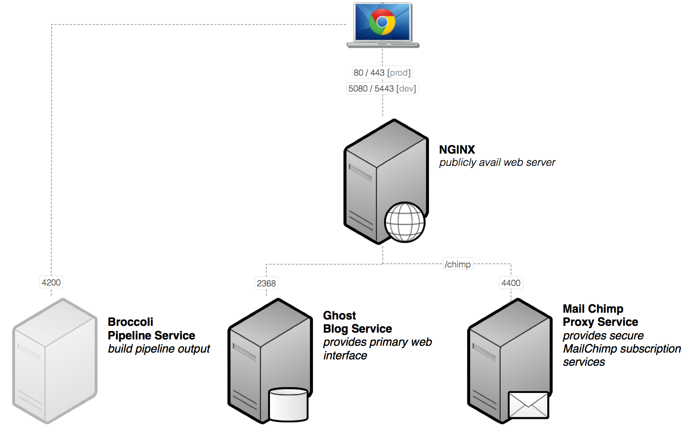

# Thematic Ghost #

This repo grew out of the need to service two key use-cases:

1. Allow tech entrepreneurs to deploy quick a single-page app for a newly created company. This would include the ability to:
	- Have a static cover page, an "about page", a "blog", and a "contact us" page out of the box
	- Provide a secure interaction with MailChimp for subscribe/unsubscribe list management
	- 
2. Provide theme developers for Ghost an efficient asset pipeline for building these themes.
	- Allow use of SASS style sheets that compile down to CSS automatically
	- Provide 





is intended to help you build an asset-pipeline for Ghost blogging themes. The asset pipeline leverages [Broccoli](https://github.com/broccolijs) to ensure that your SASS scripts are compiled, your JS concatinated, and your bower packaged included. As the image above illustrates visually, this package will do the following:

- `theme` - provide a sandbox for you to work on all your theme templates, styles, and JS
- `public` - provide a "compiled", ready-to-use ghost theme that is available in real-time (or at least microseconds away from real-time)
- `Ghost server` - provides a default Ghost server that points to your template to allow you to see the effects of your theme changes in real time

## Out of the Box ##

The "default theme" that comes out of the box is heavily based on the popular [GhostScroll](https://github.com/grmmph/GhostScroll/) theme which is ideally suited for building a pre-release marketing website. You can, of course go anywhere you like with how you design your theme and the underlying pipeline will support any amount of customisation (the assumption here is that you're not afraid of coding ... this is after all a programmer-friendly repo). That said, the default theme does have some nice starting points to get you moving quickly which include:

- Bootstrap for SASS v3.1
- Bourbon (SASS library)
- Velocity (animation on steriods)
- FontAwesome (reusable icons in the form of vector fonts)
- HightlightJS (make your code look great)

## Installation ##

To install a **Thematic Ghost** working template go to an appropriate directory and run the following:

````
git clone https://github.com/ksnyde/thematic-ghost
cd thematic-ghost
npm install
````

This will install all the required npm modules (including Ghost) along with the default bower modules as well as do very basic Ghost configuration so that your theme is available as an option in the admin interface.

## Usage ##

The basic commands are available via the npm submenu:

- `npm start` - starts both the broccoli build pipeline and the ghost server. this will automatically open your browser to the blog URL once the server has started.

## Pull Requests ##

Very open to PR's to make this a better product. I would like to keep the overall JS and CSS weight to a minimum though so consider adding your contributions as a "partial template" that can be easily added if needed rather than as an already included module. 

> Note: there may be a more graceful/effective way of enable/disabling these additional modules but I haven't had time to think of what that would be yet ... open to suggestions

## License
All of thematic-ghost is licensed under the MIT license.

Copyright (c) 2014 Ken Snyder

Permission is hereby granted, free of charge, to any person obtaining a copy of this software and associated documentation files (the "Software"), to deal in the Software without restriction, including without limitation the rights to use, copy, modify, merge, publish, distribute, sublicense, and/or sell copies of the Software, and to permit persons to whom the Software is furnished to do so, subject to the following conditions:

The above copyright notice and this permission notice shall be included in all copies or substantial portions of the Software.

THE SOFTWARE IS PROVIDED "AS IS", WITHOUT WARRANTY OF ANY KIND, EXPRESS OR IMPLIED, INCLUDING BUT NOT LIMITED TO THE WARRANTIES OF MERCHANTABILITY, FITNESS FOR A PARTICULAR PURPOSE AND NONINFRINGEMENT. IN NO EVENT SHALL THE AUTHORS OR COPYRIGHT HOLDERS BE LIABLE FOR ANY CLAIM, DAMAGES OR OTHER LIABILITY, WHETHER IN AN ACTION OF CONTRACT, TORT OR OTHERWISE, ARISING FROM, OUT OF OR IN CONNECTION WITH THE SOFTWARE OR THE USE OR OTHER DEALINGS IN THE SOFTWARE.